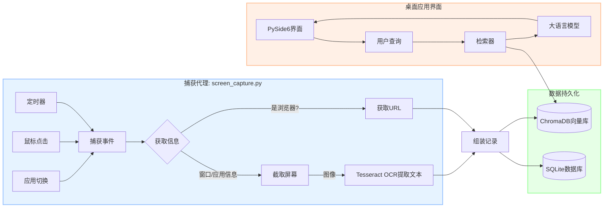

[English](readme_en.md) | 中文

# AI 桌面活动助手

## 1. 项目概述

AI 桌面活动助手是一个现代化的桌面生产力工具，采用 PySide6 构建，具有科技感的毛玻璃效果界面。它为您在电脑上的所有活动创建一个全面的、可搜索的、智能化的"数字记忆"。应用会在后台静默运行，捕捉您的屏幕截图、窗口信息和应用程序使用情况，所有数据都本地存储并索引到向量数据库中，让您可以用自然语言查询过去的行为。

您是否曾想过"我昨天浏览的那个关于机器学习的网站是什么？"或者"上周我在VSCode上花了多长时间？"。这个工具就是为了回答这些问题而设计的。

## 2. 核心功能

### 🎨 现代化桌面界面
- 科技感渐变背景和毛玻璃效果
- 现代化按钮和表格样式
- 响应式布局设计
- 系统托盘支持，可最小化到托盘

### 🧠 智能自动捕获
- **默认开启**：安装后立即开始智能记录
- **定时触发**：每30秒对工作区进行快照
- **鼠标点击**：在交互的瞬间捕获屏幕
- **应用切换**：在不同应用之间切换时记录上下文变化

### 📚 全方位数据记录
- **屏幕截图**：活动窗口的视觉记录
- **OCR文本**：使用Tesseract从截图中提取中英文文本
- **应用元数据**：窗口标题、进程名、应用名和PID
- **浏览器URL**：主动从主流浏览器中检索URL

### 🔍 自然语言搜索 (RAG)
- 用日常语言（中文或英文）查询您的活动
- 智能解析时间相关查询（如"昨天"、"过去2小时"等）
- 使用检索增强生成（RAG）流程查找最相关的历史活动

### 📊 现代化功能模块
- **💬 AI 助手对话**：自然语言查询活动记录
- **📊 使用统计**：应用使用时长统计和可视化分析
- **📋 活动记录**：查看和管理屏幕活动记录
- **⚙️ 设置**：数据管理、路径配置、API设置

### 🔒 注重隐私
- 所有数据完全本地存储
- 不依赖外部服务进行数据处理
- 用户完全控制数据收集和存储

## 3. 工作原理 (架构)

本系统构建于现代化的检索增强生成（RAG）架构之上。

### 数据流程


## 4. 技术栈

- **桌面界面**：PySide6 (Qt6)
- **图标系统**：QtAwesome (FontAwesome)
- **数据库**：SQLite (结构化数据), ChromaDB (向量搜索)
- **核心库**：
    - **屏幕/输入捕获**：`mss`, `pynput`, `pywin32`, `pygetwindow`
    - **数据处理**：`Pillow`, `pytesseract`, `psutil`
    - **AI/RAG**：`langchain`, `sentence-transformers`, `chromadb`
    - **API通信**：`httpx`
- **AI模型**：
    - **嵌入模型**：`Alibaba-NLP/gte-multilingual-base`
    - **生成式LLM**：默认使用硅基流动API (`Qwen/Qwen2.5-VL-72B-Instruct`)

## 5. 安装与配置

### 环境准备
1. **Python 3.8+**
2. **Git**
3. **Tesseract-OCR**：必须在系统上安装
    - 从 [Tesseract官方仓库](https://github.com/tesseract-ocr/tesseract) 下载
    - **重要**：安装时勾选中文简体和英文语言包
    - 默认安装路径：`C:\Program Files\Tesseract-OCR\`

### 安装步骤
1. **克隆仓库：**
    ```bash
    git clone <your-repository-url>
    cd ai-desktop-activity-assistant
    ```

2. **安装Python依赖：**
    ```bash
    python -m venv venv
    # Windows
    venv\Scripts\activate
    # macOS/Linux  
    source venv/bin/activate
    
    pip install -r requirements.txt
    ```

3. **配置API密钥：**
    在应用的设置界面中配置硅基流动API密钥，或者在`config.py`中设置。

## 6. 使用方法

### 启动应用

**方法一：使用Windows批处理文件（推荐）**
```bash
# 双击运行
启动AI助手.bat
```

**方法二：使用Python启动脚本**
```bash
python start_modern_gui.py
```

**方法三：直接启动主程序**
```bash
python modern_gui.py
```

### 使用功能
- **屏幕记录**：应用启动后默认开始记录，可在设置中控制
- **AI对话**：在对话界面用自然语言询问活动记录
- **查看统计**：在统计页面查看应用使用时长分析
- **管理记录**：在记录页面查看详细的活动记录
- **调整设置**：在设置页面配置路径、API等选项

## 7. 项目结构

```
.
├── modern_gui.py              # 主界面程序
├── start_modern_gui.py        # Python启动脚本
├── 启动AI助手.bat            # Windows启动脚本
├── screen_capture.py          # 核心数据捕获代理
├── activity_retriever.py      # RAG逻辑、数据库查询和LLM调用
├── llm_service.py            # LLM API通信封装
├── config.py                 # 核心配置
├── gui_config.py             # GUI配置管理
├── gui_settings.json         # 用户设置文件
├── modern_ui_styles.py       # 现代化UI样式
├── custom_embeddings.py      # 嵌入模型处理
├── clear_data.py             # 数据清理工具
├── kill_stuck_processes.bat  # 进程管理工具
├── requirements.txt          # Python依赖列表
├── screen_recordings/        # 截图和SQLite数据库存储
├── chroma_db_activity/       # ChromaDB向量数据库存储
├── readme.md                 # 项目说明（本文件）
├── GUI_使用说明.md          # GUI使用手册
└── 更新说明_Tesseract集成与自动刷新.md  # 更新记录
```

## 8. 配置说明

### GUI配置 (gui_settings.json)
应用会自动创建配置文件，包含：
- **窗口设置**：大小、位置、最大化状态
- **界面设置**：主题、字体、自动刷新
- **路径设置**：数据目录、截图目录、数据库目录
- **API设置**：硅基流动密钥、模型选择
- **捕获设置**：自动启动、间隔、OCR开关

### 核心配置 (config.py)
包含系统级配置和默认值。

## 9. 特色功能

### 智能时间解析
支持自然语言时间表达：
- "昨天下午我在做什么？"
- "过去2小时的活动记录"
- "今天上午的工作内容"

### 应用使用分析
- 多时间段统计（今天、昨天、本周、本月）
- 使用时长排序和百分比分析
- 应用图标和颜色区分

### 系统托盘支持
- 最小化到系统托盘
- 托盘菜单快速操作
- 双击恢复窗口

## 10. 常见问题

**Q: 屏幕录制不工作？**
A: 检查设置页面中的"屏幕录制"状态，确保已启动。

**Q: OCR识别效果不好？**
A: 确保Tesseract正确安装并包含中文语言包。

**Q: AI查询无响应？**
A: 检查设置中的API密钥配置是否正确。

**Q: 界面显示异常？**
A: 尝试重启应用或清理配置文件。

## 11. 开源协议

本项目采用 MIT 开源协议。