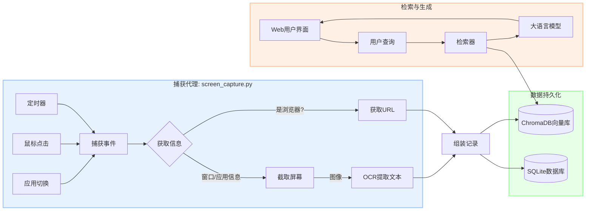

[English](readme_en.md) | 中文

# AI 桌面活动助手

## 1. 项目概述

AI 桌面活动助手是一个个人生产力工具，旨在为您在电脑上的所有活动创建一个全面的、可搜索的、智能化的"数字记忆"。它会在后台静默运行，捕捉您的屏幕截图、窗口信息和应用程序使用情况。所有这些数据随后被索引到一个向量数据库中，让您可以用自然语言查询过去的行为，并从AI助手中获得准确、具备上下文感知的回答。

您是否曾想过"我昨天浏览的那个关于机器学习的网站是什么？"或者"上周我在VSCode上花了多长时间？"。这个工具就是为了回答这些问题而设计的。

## 2. 核心功能

- **🧠 智能自动捕获**: 持续记录屏幕活动，由三种类型的事件驱动，以确保捕获到有意义的数据：
    - **定时触发**: 周期性地对您的工作区进行快照。
    - **鼠标点击**: 在交互的瞬间捕获屏幕。
    - **应用切换**: 在不同应用之间切换时记录上下文的变化。
- **📚 全方位数据记录**: 为每个事件捕获丰富、多维度的数据：
    - **屏幕截图**: 活动窗口的视觉记录。
    - **OCR文本**: 使用Tesseract从截图中提取所有文本。
    - **应用元数据**: 窗口标题、进程名、应用名和PID。
    - **浏览器URL**: 主动从大多数主流浏览器（Chrome, Edge, Firefox）中检索URL，并具备OCR提取作为后备方案。
- **🔍 自然语言搜索 (RAG)**:
    - 用日常语言（中文或英文）查询您的活动。
    - 系统能智能解析与时间相关的查询（如"昨天", "last hour", "今天上午"）。
    - 使用检索增强生成（RAG）流程来查找最相关的历史活动，并生成精确的回答。
- **📊 交互式Web仪表盘**: 一个基于Flask构建的用户友好Web界面，提供：
    - 实时聊天界面，用于查询您的活动历史。
    - 最近屏幕活动的实时信息流。
    - 应用使用时长分析仪表盘，可视化展示不同时间段（今日、昨日、本周、本月）的使用情况。
- **🔒 注重隐私**: 所有数据，包括截图和日志，都存储在您本地的机器上。
- **⚙️ 智能优化**:
    - **浏览器截图裁剪**: 自动裁剪浏览器截图的顶部区域，以移除标签页和书签栏，从而提高对主要内容的OCR准确率。
    - **操作防抖**: 防止因快速连续的鼠标点击而产生过多的重复捕获。

## 3. 工作原理 (架构)

本系统构建于一个现代化的检索增强生成（RAG）架构之上。

### 数据流程


1.  **捕获 (`screen_capture.py`)**: 一个后台脚本持续监控触发事件。一旦触发，它会收集元数据（窗口标题、应用名、URL）并对活动窗口进行截图。
2.  **处理**: 截图由Tesseract OCR处理以提取文本。如果获取浏览器URL的主要方法失败，它会尝试在OCR文本中寻找URL作为备用。
3.  **存储与索引**: 完整的记录（元数据 + OCR文本 + 截图路径）被保存在本地的 **SQLite** 数据库中用于永久存储。同时，文本信息被转换成向量嵌入并索引到本地的 **ChromaDB** 实例中。
4.  **查询 (`activity_ui.py` & `activity_retriever.py`)**: 用户在Web界面中提出问题。后端解析查询中的时间信息以过滤记录。
5.  **检索与生成**: 系统在指定时间范围内对ChromaDB进行语义搜索，以找到最相关的活动记录。这些记录随后作为上下文传递给大语言模型（LLM），生成人类可读的答案。

## 4. 技术栈

- **后端**: Python, Flask
- **数据库**: SQLite (用于结构化数据), ChromaDB (用于向量搜索)
- **核心库**:
    - **屏幕/输入捕获**: `mss`, `pynput`, `pywin32`, `pygetwindow`, `uiautomation`
    - **数据处理**: `Pillow`, `pytesseract`, `psutil`
    - **AI/RAG**: `langchain`, `sentence-transformers`, `dateparser`
    - **API通信**: `httpx`
- **前端**: 原生 JavaScript, HTML, CSS
- **AI模型**:
    - **嵌入模型**: `Alibaba-NLP/gte-multilingual-base` (或其他SentenceTransformer模型)
    - **生成式LLM**: 可配置使用如 Chutes.ai, OpenRouter 等服务 (默认通过Chutes.ai使用 `deepseek-ai/DeepSeek-V3`)。

## 5. 安装与配置

### 环境准备
1.  **Python 3.8+**
2.  **Git**
3.  **Tesseract-OCR**: 您必须在您的系统上安装Tesseract。
    - 从 [Tesseract官方仓库](https://github.com/tesseract-ocr/tesseract) 下载。
    - **重要提示**: 安装过程中，请确保勾选您需要的语言包（例如，简体中文和英文）。
    - 记住您的安装路径。

### 安装步骤
1.  **克隆仓库:**
    ```bash
    git clone <your-repository-url>
    cd <repository-name>
    ```

2.  **安装Python依赖:**
    建议使用虚拟环境。
    ```bash
    python -m venv venv
    source venv/bin/activate  # 在Windows上: venv\Scripts\activate
    pip install -r requirements.txt
    ```

3.  **配置Tesseract路径:**
    打开 `screen_capture.py` 文件，找到下面这行代码。将其路径更新为您系统中Tesseract的可执行文件路径。
    ```python
    # screen_capture.py
    pytesseract.pytesseract.tesseract_cmd = r'C:\\Program Files\\Tesseract-OCR\\tesseract.exe'
    ```

4.  **配置LLM API密钥:**
    为了保护您的API密钥，我们使用环境变量进行配置。
    a. 在项目根目录下，创建一个名为 `.env` 的新文件。
    b. 打开这个新的 `.env` 文件，并按以下格式填入您在 [Chutes.ai](https://chutes.ai/) 的API密钥：
    
    ```.env
    # .env 文件内容
    CHUTES_API_KEY="cpk_xxxxxxxxxxxxxxxxxxxxxxxxxxxxxx"
    ```
    
    **重要提示**: `.env` 文件已被添加到 `.gitignore` 中，所以您的密钥不会被意外上传到GitHub。

## 6. 使用方法

您需要在两个独立的终端中运行应用的两个主要组件。

1.  **启动捕获代理:**
    这个脚本在后台运行，记录您的活动。
    ```bash
    python screen_capture.py
    ```
    首次运行时，它会自动创建所需的数据库和目录。请保持此终端持续运行。

2.  **启动Web界面:**
    这个脚本会启动用于用户界面的Flask Web服务器。
    ```bash
    python activity_ui.py
    ```

3.  **访问助手:**
    打开您的浏览器并访问:
    **http://127.0.0.1:5001**

现在，您可以开始提问关于您活动的问题了！

## 7. 项目结构

```
.
├── screen_capture.py         # 核心数据捕获代理
├── activity_retriever.py     # 处理RAG逻辑、数据库查询和LLM调用
├── activity_ui.py            # Flask Web服务器和API端点
├── llm_service.py            # 与外部LLM API通信的封装
├── config.py                 # 所有配置项 (API密钥, 路径等)
├── requirements.txt          # Python依赖列表
├── templates/
│   └── activity_chat.html    # Web界面的HTML文件
├── screen_recordings/        # 存储截图和SQLite数据库 (自动生成)
└── chroma_db_activity/       # 存储ChromaDB向量数据库 (自动生成)
```

## 8. 未来方向

- **集成Microsoft OmniParser**: 下一个主要的升级方向是使用OmniParser替换`pytesseract`。这将把系统从简单的文本提取升级为先进的UI理解引擎，使其能够识别按钮、输入框、列表等UI元素。这将极大地提升上下文的质量，并为未来的自动化能力奠定基础。

## 9. 开源协议

本项目采用 MIT 开源协议。